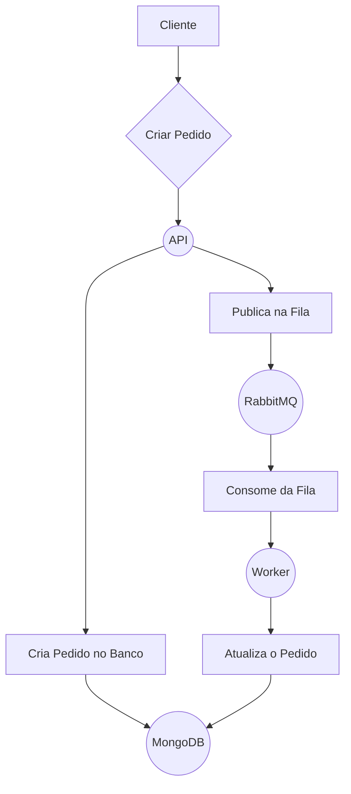

# Sistema de Pedidos de Comida com RabbitMQ

Este projeto é um exemplo de um sistema de pedidos de comida baseado em microsserviços que utiliza o RabbitMQ para comunicação assíncrona entre os serviços.

## Arquitetura

O sistema é composto por dois microsserviços:

*   **API**: Um serviço Node.js com Express que expõe uma API REST para criar e consultar pedidos. É a porta de entrada do sistema.
*   **Worker**: Um serviço Node.js que consome mensagens de uma fila do RabbitMQ para processar os pedidos de forma assíncrona.

## Tecnologias Utilizadas

*   **Node.js**: Ambiente de execução para os serviços.
*   **TypeScript**: Linguagem de programação utilizada nos serviços.
*   **Express**: Framework para a construção da API.
*   **MongoDB**: Banco de dados NoSQL para armazenar os pedidos.
*   **RabbitMQ**: Message broker para a comunicação assíncrona entre a API e o Worker.
*   **Docker**: Para a criação de contêineres para os serviços e a infraestrutura.
*   **Docker Compose**: Para a orquestração dos contêineres.

## Diagrama de Caso de Uso



## Como Executar o Projeto

### Pré-requisitos

*   [Docker](https://www.docker.com/get-started)
*   [Docker Compose](https://docs.docker.com/compose/install/)

### Executando o Sistema Completo

Para executar o sistema completo (API, Worker, MongoDB e RabbitMQ), execute o seguinte comando na raiz do projeto:

```bash
docker-compose up
```

A API estará disponível em `http://localhost:3000`.

### Executando os Serviços Individualmente

É possível executar os serviços individualmente para desenvolvimento.

**1. Inicie a Infraestrutura**

```bash
docker-compose up -d mongo rabbitmq
```

**2. Execute a API**

Em um terminal, navegue até a pasta `api` e execute:

```bash
cd api
npm run dev
```

**3. Execute o Worker**

Em outro terminal, navegue até a pasta `worker` e execute:

```bash
cd worker
npm run dev
```
